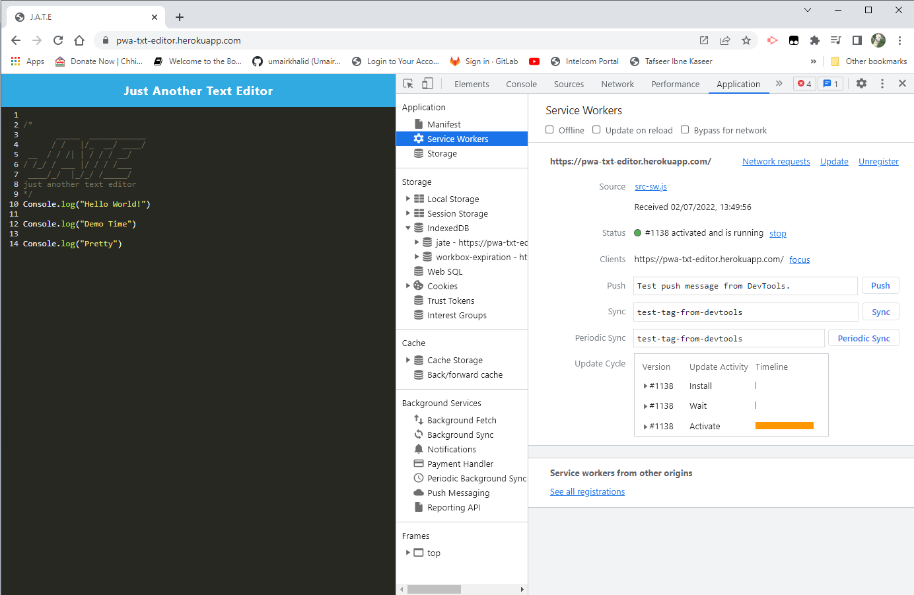
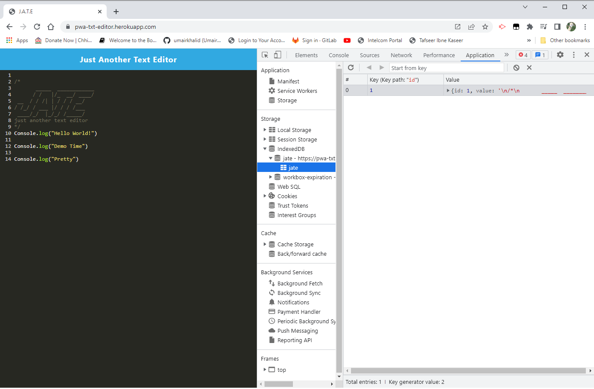

# PWA Text Editor

  
   


## Description

PWA Text Editor is an app that runs in the browser. This app is a single-page application that meets the PWA criteria. Additionally, it features a number of data persistence techniques that serve as redundancy in case one of the options is not supported by the browser. The application also functions offline.

This text editor, utilises an existing application and implement methods for getting and storing data to an IndexedDB database. It also make use of a package called `idb`, which is a lightweight wrapper around the IndexedDB API. It features a number of methods that are useful for storing and retrieving data, and is used by companies like Google and Mozilla.

## User Story

```md
AS A developer
I WANT to create notes or code snippets with or without an internet connection
SO THAT I can reliably retrieve them for later use
```

## Acceptance Criteria

```md
GIVEN a text editor web application
WHEN I open my application in my editor
THEN I should see a client server folder structure
WHEN I run `npm run start` from the root directory
THEN I find that my application should start up the backend and serve the client
WHEN I run the text editor application from my terminal
THEN I find that my JavaScript files have been bundled using webpack
WHEN I run my webpack plugins
THEN I find that I have a generated HTML file, service worker, and a manifest file
WHEN I use next-gen JavaScript in my application
THEN I find that the text editor still functions in the browser without errors
WHEN I open the text editor
THEN I find that IndexedDB has immediately created a database storage
WHEN I enter content and subsequently click off of the DOM window
THEN I find that the content in the text editor has been saved with IndexedDB
WHEN I reopen the text editor after closing it
THEN I find that the content in the text editor has been retrieved from our IndexedDB
WHEN I click on the Install button
THEN I download my web application as an icon on my desktop
WHEN I load my web application
THEN I should have a registered service worker using workbox
WHEN I register a service worker
THEN I should have my static assets pre cached upon loading along with subsequent pages and static assets
WHEN I deploy to Heroku
THEN I should have proper build scripts for a webpack application
```
## Mock-Up

The following animation demonstrates the application functionality:


The following image shows the application's `manifest.json` file:


The following image shows the application's registered service worker:



The following image shows the application's IndexedDB storage:



## Table-of-Contents
* [Installation](#installation)
* [Usage](#usage)
* [Technologies](#technologies)
* [License](#license)
* [Contributing](#contributing)
* [Questions](#questions)

## [Installation](#table-of-contents)

```
npm install
npm run build
```
## [Usage](#table-of-contents)
This project was built in Node.js using the express, Webpack plugins, Inject manifest and Service workers.
```
npm run start:dev
```

**Please remeber to clear the cache in the browser**

## [Technologies](#table-of-contents)
* JS
* Node.js
* Webpack
* CRUD IDB
* Service Worker
* Manifest

## [License](#table-of-contents)
The application is covered under the following license: [MIT](https://choosealicense.com/licenses/mit/)

## [Contributing](#table-of-contents)
To contribute to this application, create a pull request or fork the repo.

## [Questions](#table-of-contents)
If you have any question about the repo, open an issue or contact me directly at [Email: umairkhalid@fastmail.fm](mailto:umairkhalid@fastmail.fm).
You can find more of my work at [GitHub](https://github.com/umairkhalid).

---
© 2022 Umair Khalid. Confidential and Proprietary. All Rights Reserved.
